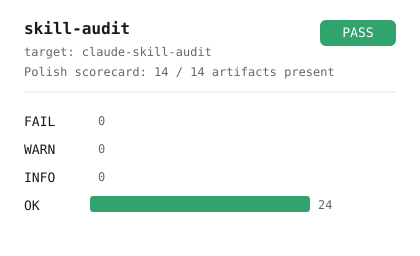

# skill-audit

An agent skill (Claude Code, Codex, agy, Cursor) that audits other skills against the conventions of a
public-release repository -- file presence, format validity, code style,
hardcoded paths -- and complements those deterministic checks with five
LLM-driven judgement passes (README quality, SETUP completeness, CHANGELOG
significance, language coherence, alignment with the base example).

<picture>
  <source media="(prefers-color-scheme: dark)" srcset="docs/demo-dark.svg">
  
</picture>

## What it is

Two-layer audit:

- **Layer 1** is a small Python runner, stdlib-only at runtime, that walks
  the target skill, detects expected artifacts, and validates their format
  when present. It produces a schema-v2 JSON report. Most of Layer 1 is
  the vendored `scripts/auditlib/` engine shared with
  [`claude-skill-repo-audit`](https://github.com/lucas-lima-s/claude-skill-repo-audit);
  this repo contributes three skill-specific checks plus two profiles.
- **Layer 2** is delegated to the agent invoking the skill. The
  agent reads the JSON, applies five curated prompts to the relevant
  files, appends judgement findings, and renders the final markdown.

The audit produces a **maturity scorecard** ("12 / 14 artifacts present")
plus a list of findings, each tagged `OK`, `INFO`, `WARN`, or `FAIL`. Layer
2 never escalates to `FAIL` -- that is reserved for objective failures
(e.g. an invalid `pyproject.toml`).

## Installation

```bash
git clone https://github.com/lucas-lima-s/claude-skill-audit.git <skill-dir>
```

Expose `<skill-dir>` to each agent through its skills directory (for
example `~/.claude/skills/audit`, `~/.agents/skills/audit`, or
`~/.gemini/config/skills/audit`) as a symlink or a copy. The folder name is
the command name, so it should match `name: audit` in `SKILL.md`.

The skill is portable: scripts are found relative to the skill directory,
the interpreter comes from `$SKILLS_PYTHON`, and reports go to `$TEMP` /
`$env:TEMP`. No paths are hardcoded. See
[`SETUP.md`](SETUP.md) for env-var details and [`CONTRIBUTING.md`](CONTRIBUTING.md)
for development setup.

### Prerequisites

- Python 3.11+ exposed via `$SKILLS_PYTHON` or on `PATH`.
- An agent that loads skills (Claude Code, Codex, agy or Cursor); the
  scripts `check.py` and `report.py` also run standalone.

## Usage

Once installed, the agent recognises `/audit` and natural-language phrases such as "audit
this skill", "is this skill ready to publish", or the pt-BR "audita essa
skill" / "checa a skill X".

### Standalone invocation

```bash
"$SKILLS_PYTHON" scripts/check.py <skill-path> --profile skill-public
# The last line of stdout is `JSON_PATH=<abs-path>`.

"$SKILLS_PYTHON" scripts/report.py --json <abs-path>
```

`check.py` exits `1` if any Layer 1 finding has severity `FAIL`, `2` on a
bad path, else `0`. `report.py` exits `2` on a missing file, invalid JSON,
or an unsupported `schema_version`; `1` on any Layer 1 `FAIL`; else `0`.
Full envelope in [`docs/json_contract.md`](docs/json_contract.md).

## What it checks

| check id | severity | what it catches |
|---|---|---|
| `artifacts.*` | FAIL (SKILL.md) / WARN / INFO | presence of the 14 canonical files |
| `skill_md.frontmatter` | FAIL | missing or empty `description:` |
| `skill_md.description_length` | INFO / WARN | description under 40 chars (INFO) or over 300 (WARN) |
| `skill_md.size` | WARN | SKILL.md over 500 lines |
| `skill_md.name_matches_dir` | WARN | `name:` differs from the skill directory (ignoring a `claude-skill-` / `skill-` prefix) |
| `skill_md.claude_only_tools` | INFO | Claude Code-only tools or slash commands with no note for other agents |
| `skill_md.allowed_tools` | INFO | Python scripts without `allowed-tools:` |
| `skill_layout.root_python` | WARN | `*.py` at the skill root instead of `scripts/` |
| `skill_layout.tmp_tracked` | INFO | `scripts/_tmp/` or `data/_tmp/` tracked in git |
| `skill_layout.broken_script_ref` | WARN | a `scripts/*.py` path in SKILL.md that doesn't exist |
| `gitattributes.eol` / `.linguist` | WARN / INFO | missing eol normalization / generated-asset attributes |
| `gitignore.coverage` | WARN | missing coverage for a known artefact family |
| `pyproject.format` | FAIL / WARN / INFO | no linter+formatter configured / incomplete |
| `dev_deps.declared` | INFO / WARN | no dev dependency group / `pytest` missing with `tests/` present |
| `ci_workflow.matrix` / `.parser_limit` | WARN | missing os x version matrix / unexpanded `include:`/anchors |
| `changelog.format` | WARN | missing `# Changelog` header or `## [Unreleased]` |
| `python_style.future` / `.typing_aliases` / `.parse` | WARN / INFO | missing future import, deprecated typing aliases, syntax errors |
| `runtime_stdlib.import` | WARN | an import with no declared source |
| `hardcoded_paths.literal` | FAIL | a machine-specific path literal |
| `layer2.budget.*` | INFO | inputs dropped to fit `--max-layer2-bytes` |

Full rationale, per-profile severities, and "what is deliberately not
checked" in [`docs/rules.md`](docs/rules.md).

## Profiles

| Profile | When to pick it | Behaviour |
|---|---|---|
| `skill-public` | Skill is (or aims to be) on a public repo | Full severity. Missing README/SETUP/`.gitignore` = WARN. |
| `skill-local` | Personal skill, no public-release ambition | WARN-on-absence downgraded to INFO. Less noise. |

Default is `skill-local`. Override per invocation with `--profile
skill-public` (or the legacy `--profile public` alias), or pin one in a
`skill-audit.toml` at the target skill's root.

## Bootstrapping a new skill

```bash
uv run python scripts/init_skill.py --out <skills-dir>/my-new-skill \
  --name my-new-skill --description "What my-new-skill does."
```

Materializes `examples/base_skill/` into the target directory, substituting
the name into `SKILL.md`, `README.md`, `SETUP.md`, `CHANGELOG.md`, and
`pyproject.toml`. The result audits clean under `--profile skill-public`.

## Mechanical fixes

```bash
uv run python scripts/fix.py <skill-path>          # dry run: prints a diff
uv run python scripts/fix.py <skill-path> --apply  # writes it
```

Limited to corrections with exactly one correct answer: the
`.gitattributes` eol line, a `## [Unreleased]` header, Python-cache
`.gitignore` coverage. Never touches `SKILL.md`, `README.md`, or any Python
source.

## Structure

```
.
+-- SKILL.md                  # skill entry point
+-- SETUP.md                  # env vars, configuration
+-- README.md                 # this file
+-- LICENSE                   # MIT
+-- CHANGELOG.md               # Keep a Changelog
+-- CONTRIBUTING.md           # dev setup, commit policy
+-- pyproject.toml            # uv + ruff (lint and format)
+-- uv.lock
+-- skill-audit.toml          # self-config (profile = skill-public)
+-- profiles/                 # skill-public.toml, skill-local.toml
+-- prompts/                  # aspiration_to_base_skill.md (skill-specific)
+-- scripts/
|   +-- check.py              # Layer 1 entry point
|   +-- report.py             # markdown renderer
|   +-- init_skill.py         # --init: scaffold a new skill
|   +-- fix.py                # --fix: mechanical corrections
|   +-- sync_auditlib.py      # re-vendor + drift gate
|   +-- render_demo.py        # regenerates docs/demo-*.svg
|   +-- auditlib/             # VENDORED from claude-skill-repo-audit -- do not edit;
|   |                         # edit upstream and run scripts/sync_auditlib.py
|   +-- checks/               # skill-specific: skill_md, skill_layout, runtime_stdlib
+-- examples/
|   +-- base_skill/           # functional reference skill (audits perfect)
+-- tests/                    # pytest suite
+-- docs/
    +-- rules.md              # rationale for every check id
    +-- json_contract.md      # schema v2
    +-- layer2_prompts.md     # index of the five LLM prompts
```

## License

[MIT](LICENSE).
